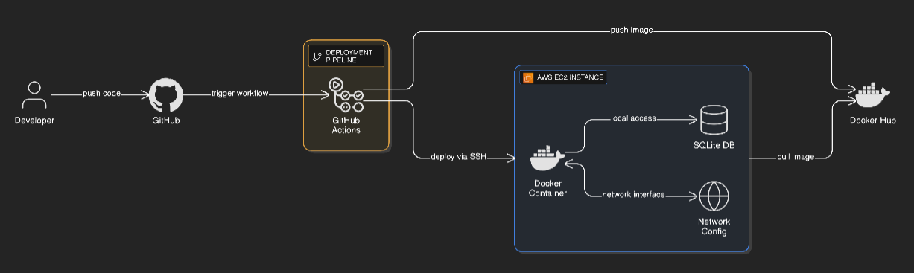

# Task Tracker API - DevOps Assignment

A containerized Task Tracker REST API with Infrastructure as Code, CI/CD pipeline, and monitoring.

## 🏗️ Architecture


## 📋 Requirements Met

✅ Task Tracker API (Flask)  
✅ POST /tasks and GET /tasks endpoints  
✅ SQLite database for persistence  
✅ Dockerized application  
✅ Terraform infrastructure provisioning (EC2, Security Group, S3)  
✅ Shell script deployment (no Ansible/Kubernetes)  
✅ CI/CD with GitHub Actions  
✅ Automated deployment to AWS  

## 🚀 Quick Start

### 1. Local Testing

```
# Clone the repository
git clone <your-repo-url>
cd task-tracker-project

# Test Flask app directly
python3 -m venv venv
source venv/bin/activate
pip install -r app/requirements.txt
export DB_PATH=./data/tasks.db
python app/app.py

# Test API
curl http://localhost:8000/health
curl -X POST http://localhost:8000/tasks -H "Content-Type: application/json" -d '{"title":"Test"}'
curl http://localhost:8000/tasks
```

### 2. Docker Build & Test

```
# Build image
docker build -t task-tracker:local .

# Run container
docker run -d --name task-tracker -p 8000:8000 -v $(pwd)/data:/data task-tracker:local

# Test
curl http://localhost:8000/tasks
```

### 3. AWS Infrastructure Provisioning

```
# Configure AWS credentials
export AWS_ACCESS_KEY_ID="your-access-key"
export AWS_SECRET_ACCESS_KEY="your-secret-key"

# Update terraform/terraform.tfvars with your key pair name
cd terraform
terraform init
terraform plan
terraform apply

# Save outputs
terraform output ec2_public_ip
terraform output s3_bucket_name
```

### 4. Manual Deployment

```
# Push image to Docker Hub
docker login
docker tag task-tracker:local YOUR_USERNAME/task-tracker:latest
docker push YOUR_USERNAME/task-tracker:latest

# Deploy to EC2
chmod +x scripts/deploy.sh
./scripts/deploy.sh ubuntu@<EC2_PUBLIC_IP> YOUR_USERNAME/task-tracker:latest 80
```

### 5. GitHub Actions Setup

Add these secrets in GitHub repository settings:

| Secret Name | Value |
|------------|-------|
| `DOCKERHUB_USERNAME` | Your Docker Hub username |
| `DOCKERHUB_TOKEN` | Docker Hub access token |
| `EC2_HOST` | EC2 public IP address |
| `EC2_USER` | `ubuntu` |
| `EC2_SSH_KEY` | Contents of your .pem private key |

Push to main branch to trigger automated deployment.

## 🧪 Testing the API

```
# Get EC2 IP
EC2_IP=$(cd terraform && terraform output -raw ec2_public_ip)

# Health check
curl http://$EC2_IP/health

# Create tasks
curl -X POST http://$EC2_IP/tasks \
  -H "Content-Type: application/json" \
  -d '{"title": "Setup infrastructure"}'

curl -X POST http://$EC2_IP/tasks \
  -H "Content-Type: application/json" \
  -d '{"title": "Deploy application"}'

# List all tasks
curl http://$EC2_IP/tasks | jq
```

## 📁 Project Structure

```
task-tracker-project/
├── app/
│   ├── app.py              # Flask application
│   └── requirements.txt    # Python dependencies
├── terraform/
│   ├── main.tf            # AWS resources
│   ├── variables.tf       # Input variables
│   ├── outputs.tf         # Output values
│   └── terraform.tfvars   # Configuration values
├── scripts/
│   └── deploy.sh          # Deployment script
├── .github/
│   └── workflows/
│       └── ci-cd.yml      # CI/CD pipeline
├── Dockerfile             # Container definition
├── .gitignore
└── README.md
```

## 🛠️ Technologies Used

- **Application**: Flask (Python)
- **Database**: SQLite
- **Containerization**: Docker
- **IaC**: Terraform
- **Cloud**: AWS (EC2, S3, Security Groups)
- **CI/CD**: GitHub Actions
- **Deployment**: Shell scripts (SSH)

## 🔒 Security Considerations

- Security group allows ports 80/3000 as required
- SSH port 22 restricted (can be limited to specific IP)
- Database persisted in Docker volume
- Secrets managed via GitHub Actions

## 📊 Monitoring

Basic monitoring can be added:

```
# View container logs
ssh ubuntu@<EC2_IP>
sudo docker logs -f task-tracker

# Check container status
sudo docker ps
sudo docker stats task-tracker
```

## 🧹 Cleanup

```
# Destroy AWS infrastructure
cd terraform
terraform destroy

# Remove local containers
docker stop task-tracker
docker rm task-tracker
docker rmi task-tracker:local
```

## 📝 Notes

- SQLite used for simplicity (PostgreSQL can be used for production)
- Application runs on port 8000 internally, exposed on port 80
- Data persists in `/opt/task-tracker-data` on EC2
- Auto-restart enabled for container resilience

## 🎯 Assignment Requirements

This project fulfills all DevOps assignment requirements:

1. ✅ Application Setup - Flask API with POST/GET endpoints and SQLite
2. ✅ Infrastructure Provisioning - Terraform with EC2, Security Group, S3
3. ✅ App Deployment - Dockerized with shell script deployment
4. ✅ CI/CD Pipeline - GitHub Actions with automated build and deploy
5. ✅ Documentation - Complete README with setup instructions

## 👤 Author

Shebin Babu 
Date: November 2025
```

***

## 📦 Complete Setup Commands

Run these commands in sequence to set up everything:

```bash
# 1. Create project structure
mkdir -p task-tracker-project/{app,terraform,scripts,.github/workflows}
cd task-tracker-project

# 2. Create all files (copy content from above into each file)
# Or clone if you've pushed to GitHub

# 3. Initialize git
git init
git add .
git commit -m "Initial commit - Task Tracker DevOps project"

# 4. Test locally
python3 -m venv venv
source venv/bin/activate
pip install -r app/requirements.txt
python app/app.py

# 5. Test Docker
docker build -t task-tracker:local .
docker run -d --name test -p 8000:8000 -v $(pwd)/data:/data task-tracker:local
curl http://localhost:8000/tasks

# 6. Create GitHub repository
# Go to github.com → New repository → Follow instructions

# 7. Push to GitHub
git remote add origin https://github.com/YOUR_USERNAME/task-tracker-project.git
git branch -M main
git push -u origin main

# 8. Configure AWS credentials
export AWS_ACCESS_KEY_ID="your-key"
export AWS_SECRET_ACCESS_KEY="your-secret"

# 9. Update terraform/terraform.tfvars with your AWS key pair name

# 10. Deploy infrastructure
cd terraform
terraform init
terraform apply
cd ..

# 11. Push to Docker Hub
docker login
docker tag task-tracker:local YOUR_USERNAME/task-tracker:latest
docker push YOUR_USERNAME/task-tracker:latest

# 12. Deploy manually (first time)
EC2_IP=$(cd terraform && terraform output -raw ec2_public_ip)
./scripts/deploy.sh ubuntu@$EC2_IP YOUR_USERNAME/task-tracker:latest 80

# 13. Configure GitHub secrets and push to trigger CI/CD
```

***

## ✅ Checklist

Before submission, verify:

- [ ] All files created as shown above
- [ ] Local Flask app runs successfully
- [ ] Docker container builds and runs
- [ ] Terraform applies without errors
- [ ] EC2 instance accessible via SSH
- [ ] Manual deployment script works
- [ ] Docker image pushed to Docker Hub
- [ ] GitHub Actions secrets configured
- [ ] CI/CD pipeline runs successfully
- [ ] API endpoints work on EC2 (port 80)
- [ ] README.md includes architecture diagram
- [ ] Database persists across container restarts

***

This is your **complete, production-ready solution** with all files. Just copy each file, update the placeholder values (AWS key pair name, Docker Hub username, etc.), and you're ready to deploy![1]
